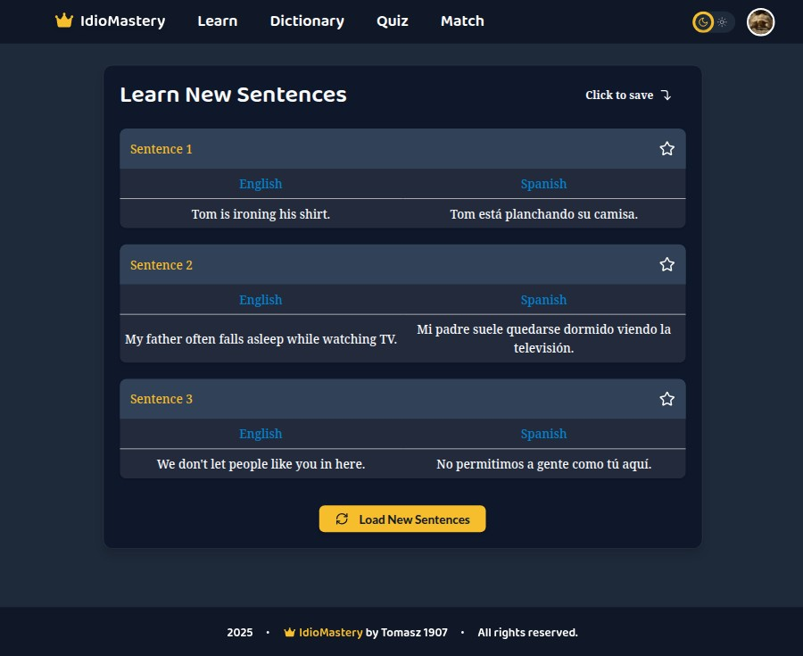
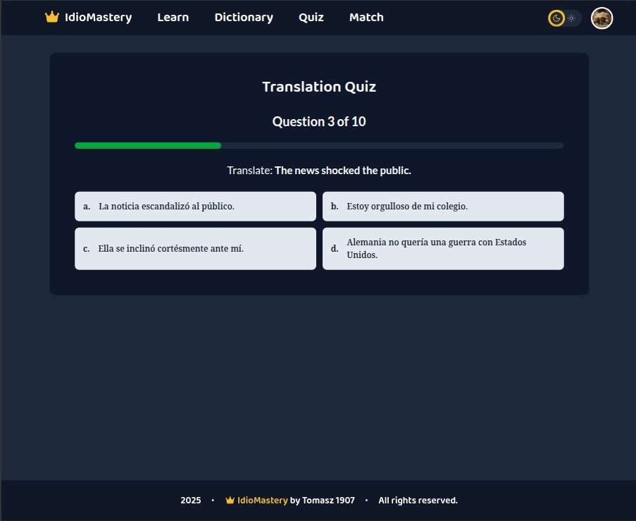
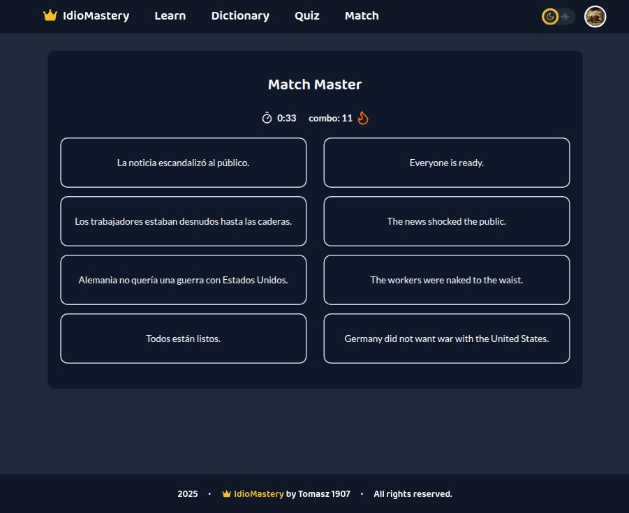

# IdioMastery - Spanish-English Learning App

A **fun, interactive, and gamified** language learning app to master Spanish vocabulary through flashcards, quizzes, and matching games.

---

## Features

- **Dashboard**: Check your progress, stay motivated
- **Learn**: Save new words with a star
- **Dictionary**: Review all saved words
- **Quiz**: Test your knowledge with multiple-choice
- **Match**: Fast-paced matching game with timer
- **Profile**: Change your avatar or name, you can delete the account

---

## Tech Stack

- **Frontend**: React, TypeScript, Tailwind CSS, Shadcn, Framer Motion
- **Backend**: Firebase (Auth, Realtime Database)
- **UI**: ShadCN UI, Lucide Icons
- **CSV**: `englishspanish.csv` for 1000+ word pairs

---

# Dataset - Englishspanish.csv

Dataset from https://www.kaggle.com/datasets/lonnieqin/englishspanish-translation-dataset/data by Lonnie

# Auth page background

Background picture from https://cdn.pixabay.com/photo/2017/12/30/16/52/mountain-3050474_1280.jpg by Monigocan

## Live Demo

[https://idiomastery.web.app/](https://idiomastery.web.app/)

---

## Screenshots

| Learn                                    | Quiz                                   | Match                                    |
| ---------------------------------------- | -------------------------------------- | ---------------------------------------- |
|  |  |  |

---
